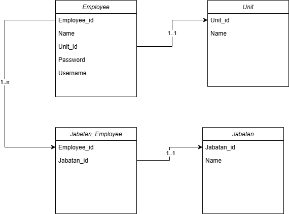

# Employee Management

This is an employee management system built with Laravel. The application provides features to manage employees and login information using seeders.

## Prerequisites

Before setting up the project, make sure you have the following installed:

- PHP >= 8.0
- Composer
- Laravel
- MySQL

## Setup Instructions

1. **Clone the Repository**
   ```bash
   git clone https://github.com/KurniaAmerta/employee-management.git
   cd employee-management
   ```

2. **Install Dependencies**
   Run the following command to install the required dependencies:
   ```bash
   composer install
   ```

3. **Environment Configuration**
   Copy the `.env.example` file and rename it to `.env`:
   ```bash
   cp .env.example .env
   ```
   Then update the database credentials and other necessary configurations in the `.env` file.

4. **Generate Application Key**
   Run the following command to generate the application key:
   ```bash
   php artisan key:generate
   ```

5. **Run Migrations and Seeders**
   Execute the database migrations to create the necessary tables:
   ```bash
   php artisan migrate
   ```

   Then, seed the database with default data:
   ```bash
   php artisan db:seed
   ```

   Alternatively, if you want to seed only specific seeders, you can run:
   ```bash
   php artisan db:seed --class=EmployeeSeeder
   php artisan db:seed --class=LoginSeeder
   ```

6. **Run the Development Server**
   Start the local development server:
   ```bash
   php artisan serve
   ```
   The application will be accessible at `http://127.0.0.1:8000/`.

## Seeders Included

### EmployeeSeeder
The `EmployeeSeeder` populates the database with sample employee data. This is useful for testing and development purposes.

### LoginSeeder
The `LoginSeeder` creates default log login. . This is useful for testing and development purposes.

## Default Login Credentials
After running the `LoginSeeder`, you can log in using the default credentials:

- **Username:** `admin`
- **Password:** `password`

You can customize these values in the `LoginSeeder` before running the seeder.

## Additional Commands

- **Clear Cache:**
  ```bash
  php artisan cache:clear
  ```

- **Reset Migrations and Seed Data:**
  ```bash
  php artisan migrate:fresh --seed
  ```
